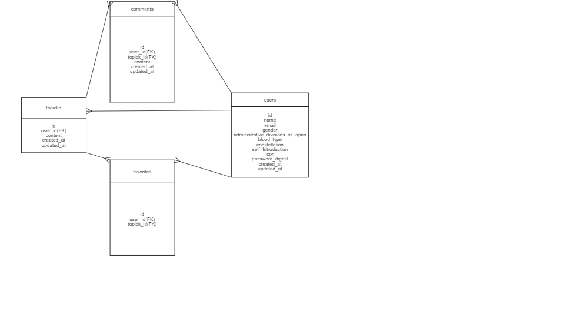
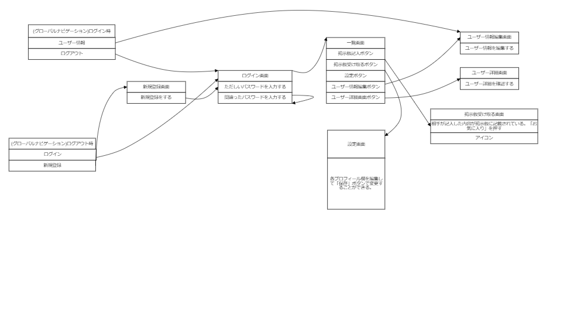

# README

## 概要
* Feelingは悩みを相談できるアプリである。

## 制作背景
* 悩みを相談できるアプリがあるとよいと感じこのアプリを制作しました。
## 開発言語

* Ruby2.6.5
* Rails5.2.6
## 就業Tremの技術

* コメント機能
* お気に入り機能
## カリキュラム外の技術

* ransack
## 実行手順

```
$ git clone git@github.com:hayato0904/portfolio.git
$ cd portfolio
$ bundle install
$rails db:create && rails db:migrate
$rails s -b 0.0.0.0
```
## カタログ設計
https://docs.google.com/spreadsheets/d/1HeF4tUjHs5uRWC3L3XbsL5mtavf1yBFicDYonKb68wM/edit?usp=sharing

## テーブル定義書
https://docs.google.com/spreadsheets/d/1rgfquKTtPbtorDCt_-yCBR5dVYbVycyMa2ToGSO2rA0/edit#gid=513638561

## ワイヤーフレーム
https://cacoo.com/diagrams/x5RGGDIbU1Byx5Wm/AE0FC

## ER図
https://cacoo.com/diagrams/UAxMy9KeZErbFJZ7/48651


## 画面遷移図
https://cacoo.com/diagrams/gIYfsUyvyE1lyggZ/BA862


rails g scaffold Blog name:string email:string content:text


* Services (job queues, cache servers, search engines, etc.)

* Deployment instructions

* ...
